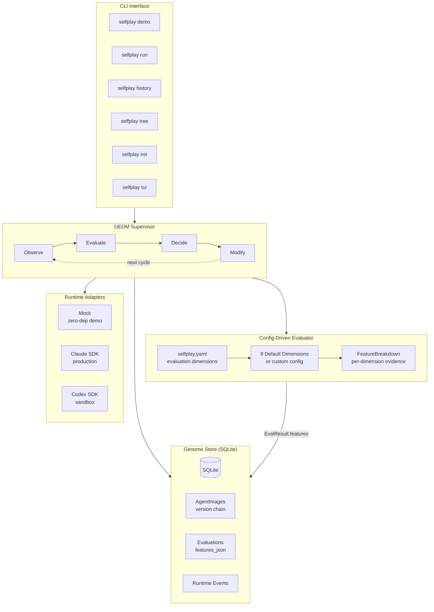
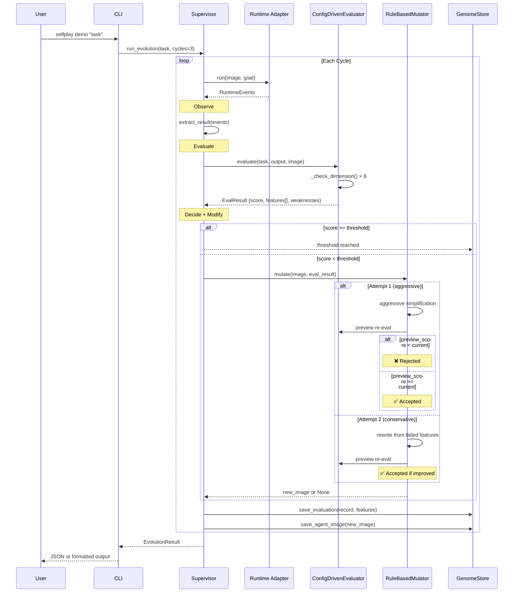
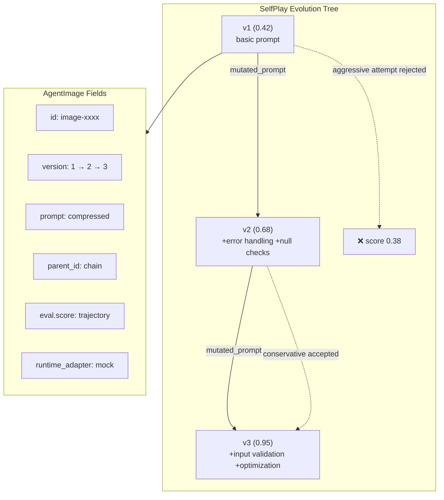
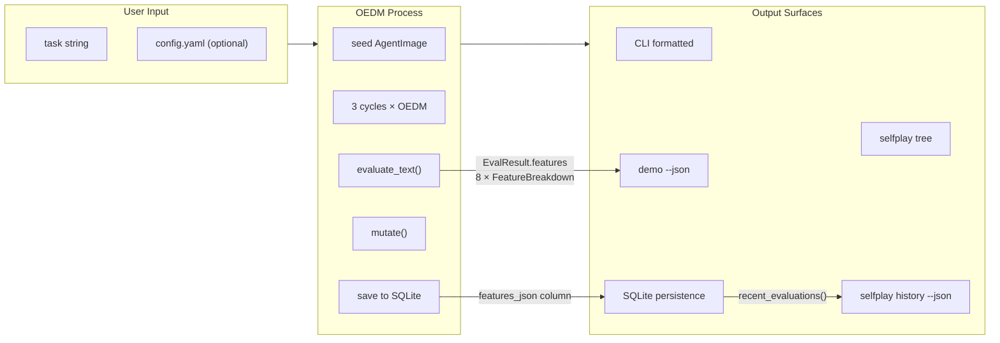
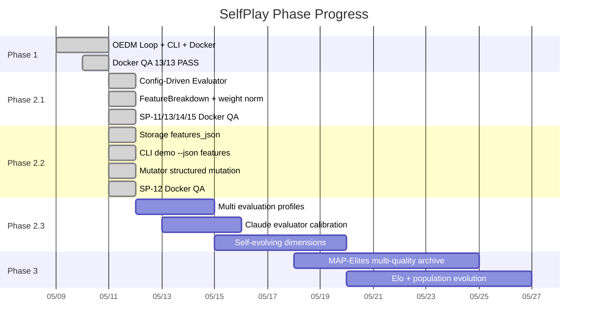

# SelfPlay Architecture Diagrams (Mermaid)

> **Version**: Phase 2.2 (implemented + verified)
> **Date**: 2026-05-11
> **Source**: docs/architecture.md + src/selfplay/ code

---

## 1. System Overview

## 2. OEDM Loop (Config-Driven)

## 3. Config-Driven Evaluator Detail

```mermaid
graph LR
    subgraph Config["selfplay.yaml"]
        Y1["evaluation.dimensions:"]
        Y2["  - id: conclusion"]
        Y3["  - id: evidence"]
        Y4["  - id: next_step"]
        Y5["  - ... 8 total"]
    end

    subgraph Default["DEFAULT_DIMENSIONS"]
        D1["conclusion (0.16)"]
        D2["evidence (0.16)"]
        D3["error_handling (0.14)"]
        D4["next_step (0.12)"]
        D5["performance (0.12)"]
        D6["examples (0.10)"]
        D7["structure (0.10)"]
        D8["length (0.10)"]
    end

    subgraph Check["_check_dimension()"]
        C1{{type=keyword?}}
        C2["keyword search"]
        C3{{type=pattern?}}
        C4["regex search"]
        C5{{type=length?}}
        C6["len(output) >= min"]
        C1 -->|yes| C2
        C1 -->|no| C3
        C3 -->|yes| C4
        C3 -->|no| C5
    end

    subgraph Result["FeatureBreakdown"]
        R1["id: str"]
        R2["label: str"]
        R3["passed: bool"]
        R4["score: float"]
        R5["raw_weight → effective_weight"]
        R6["evidence: str (≤80 chars)"]
    end

    Config -->|pyyaml| Check
    Default -->|no config| Check
    Check --> Result

    subgraph Normalize["Weight Normalization"]
        N1["effective_weight =<br/>raw_weight / sum(enabled weights)"]
    end
    Result --> Normalize
```

## 4. Genome / AgentImage Version Chain

## 5. Data Flow: Docker QA Verification

## 6. Phase Roadmap (Implemented)

