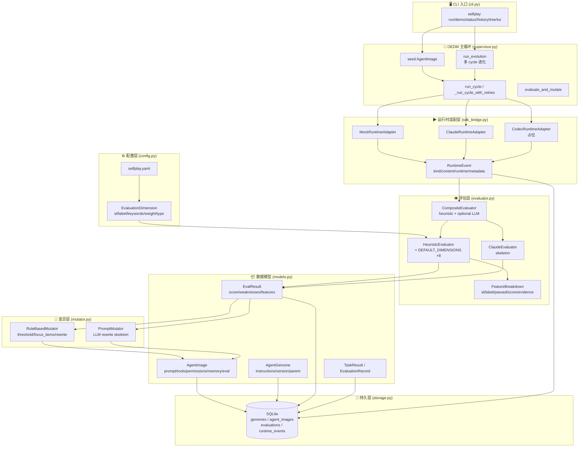
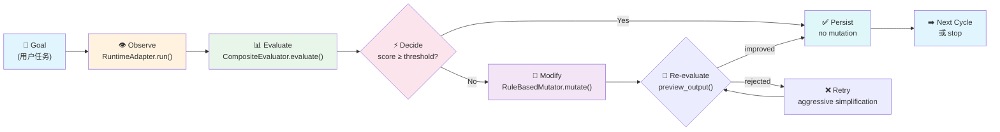
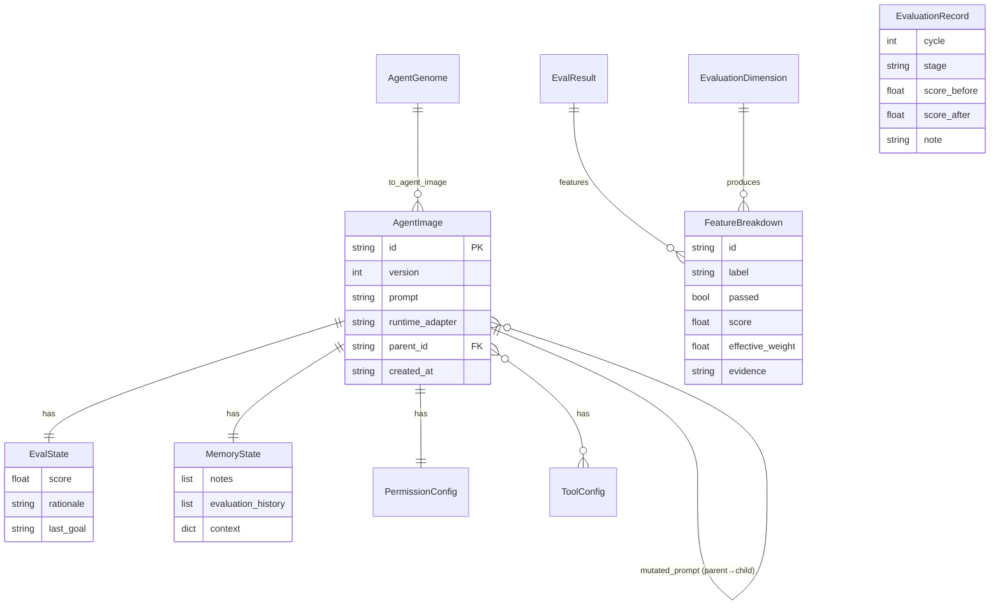
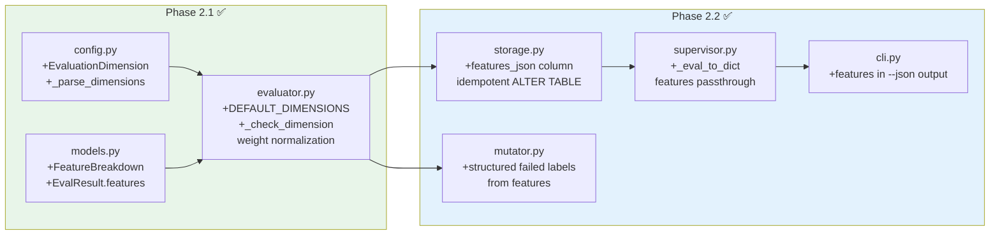
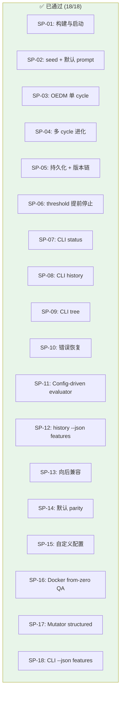
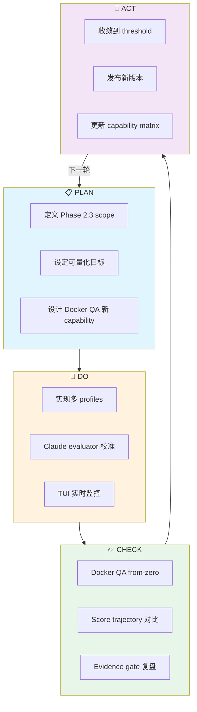

# SelfPlay 架构图 — Mermaid 可视化 + PDCA 迭代基线

**版本**: Phase 2.2 完成 (2026-05-11)
**作者**: Solution Architect
**用途**: 架构可视化基线 → 驱动下一轮 PDCA 迭代

---

## 1. 系统全景架构

## 2. OEDM 闭环流程

## 3. 数据模型关系

## 4. Phase 2.1/2.2 变更热点

## 5. Docker QA 能力矩阵状态

## 6. PDCA 迭代分析 — 下一步机会

### 6.1 当前 Gap 识别

```mermaid
graph LR
    subgraph GAPS["🎯 迭代机会"]
        GAP1["Phase 2.3: 多 profiles<br/>+ Claude 校准"]
        GAP2["Web UI / TUI 实时监控"]
        GAP3["自进化维度<br/>dimensions 自我优化"]
        GAP4["多 Agent 协作<br/>Codex sandbox"]
        GAP5["国际化 id→guidance map"]
        GAP6["发布后 evidence gate<br/>48h PDCA 复盘"]
    end

    subgraph STRENGTH["💪 已有能力"]
        S1["OEDM 闭环"]
        S2["Config-driven evaluator"]
        S3["Feature breakdown"]
        S4["Docker QA 18/18"]
        S5["Bach SOP evidence"]
    end

    STRENGTH -->|迭代基线| GAPS

    style GAPS fill:#fff3e0
    style STRENGTH fill:#e8f5e9
```

### 6.2 PDCA 循环规划

## 7. 关键架构决策记录 (ADR)

| ADR | 决策 | 理由 | 状态 |
|-----|------|------|------|
| ADR-1 | SQLite 单文件持久 | 零部署依赖，CLI 友好 | ✅ 稳定 |
| ADR-2 | Protocol-based 抽象 | Runtime/Evaluator/Mutator 可插拔 | ✅ 稳定 |
| ADR-3 | Config-driven dimensions | Phase 1→2 核心杠杆点 | ✅ Phase 2.1 |
| ADR-4 | FeatureBreakdown 结构化 | 证据驱动变异，不再靠字符串 | ✅ Phase 2.2 |
| ADR-5 | PyYAML optional | mock 模式零依赖 | ✅ Phase 2.1 |
| ADR-6 | Per-cycle retry + aggressive simplification | 突破 D5 单点阻塞 | ✅ Phase 2.2 |
| ADR-7 | Codex adapter 占位 | 等 sandbox 成熟 | 🔜 Phase 2.3+ |

---

**下一步**: 用户决定 Phase 2.3 scope 或发布优先级。此文档作为架构可视化基线，支持 Bach SOP evidence-driven PDCA。
