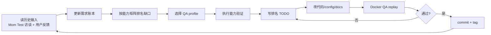

# SelfPlay Docker QA 能力矩阵

**Version**: 1.0
**Last updated**: 2026-05-11
**Scope**: SelfPlay Python CLI 工具的 Docker QA 能力验证，参考 Bach Orchestra Docker QA SOP 方法论。

## 0. 通过定义

一次 Docker QA run 通过，当且仅当：

1. Docker 从零构建（`docker build --no-cache`），无缓存依赖。
2. 每个验证的能力项有至少两个证据面（CLI 输出 + DB/日志/文件系统）。
3. 不使用 mock 证据通过验收。单元测试中的 mock 仅作辅助证据，不能替代真实 Docker CLI 验证。
4. 失败项转化为排名 TODO（优先级 + 证据 + 下次验证路径）。
5. 通过后 commit + tag；未通过则记录阻塞项。

## 1. 与 Bach SOP 的差异适配

| Bach 能力 | SelfPlay 适配 | 说明 |
| --- | --- | --- |
| DQA-01 Docker stack health | SP-01 单容器 health | SelfPlay 是单 Python 容器，非微服务集群 |
| DQA-02 Auth/OTP | 不适用 | SelfPlay 无 auth 流程 |
| DQA-03 CLI source/env | SP-02 包版本 + Python env | pip install 而非 npm |
| DQA-04 Team/chat/session | 不适用 | SelfPlay 无团队/chat 概念 |
| DQA-07 Task lifecycle | SP-05 OEDM cycle lifecycle | SelfPlay 的 "task" 是进化 cycle |
| DQA-08 Score/token/genome | SP-06 Score + genome 持久化 | SQLite 替代 Postgres |
| DQA-09 Recoverability | SP-09 DB checkpoint/restore | SQLite 文件级 checkpoint |

## 2. 能力矩阵

| ID | 能力 | 证据面 | 通过门槛 |
| --- | --- | --- | --- |
| SP-01 | Docker 构建与容器启动 | `docker build` 日志、`docker run` 退出码、`selfplay --version` 输出 | 构建成功 + `selfplay --version` 返回预期版本号 |
| SP-02 | 包版本与 Python 环境 | CLI 输出、`pip show selfplay`、Python 版本 | 版本号一致，Python >= 3.11，无依赖缺失 |
| SP-03 | `selfplay init` 初始化 | 文件系统（selfplay.yaml + data/ 目录）、CLI 输出 | config 文件存在且可解析，data 目录已创建 |
| SP-04 | `selfplay status` 状态查询 | CLI 输出（--json）、SQLite 文件存在且可读 | JSON 输出包含 genomes/agent_images/evaluations 计数 |
| SP-05 | `selfplay demo` OEDM 闭环 | CLI 输出（含 emoji 标记）、SQLite evaluations 表、runtime_events 表 | 至少 1 个 cycle 完成，score_before → score_after 有变化，evaluations 表有记录 |
| SP-06 | Score + Genome 持久化 | `selfplay history --json`、`selfplay image --json`、SQLite 表 | history 返回评估记录，image 返回最新 AgentImage，parent_id 链可追溯 |
| SP-07 | `selfplay run` 多轮进化 | CLI 输出、SQLite evaluations 记录数、agent_images 版本递增 | 多 cycle 执行，版本号递增，总提升量可计算 |
| SP-08 | D5 被拒绝的 mutation | CLI 输出（❌ Rejected 行）、rejected_attempts 字段 | 至少出现 1 次拒绝，rejected_attempts 非空，最终被接受 mutation 的 score 高于被拒绝的 |
| SP-09 | 数据持久化与可恢复性 | SQLite 文件、`selfplay tree` 输出、data/ 目录结构 | 两次运行间数据不丢失，parent chain 完整，tree 输出有内容 |
| SP-10 | `--runtime` 切换 | CLI 输出、error event、fallback 行为 | mock 正常运行；claude/codex 在无 SDK 时优雅降级，产出 error event 而非崩溃 |

## 3. From-Zero 构建流程

```bash
# Step 1: 清理旧镜像和容器
docker rm -f selfplay-qa 2>/dev/null
docker rmi selfplay-qa 2>/dev/null

# Step 2: 无缓存构建
docker build --no-cache -t selfplay-qa .

# Step 3: 运行版本检查
docker run --rm selfplay-qa selfplay --version

# Step 4: 初始化
docker run --rm -v selfplay-data:/app/data selfplay-qa selfplay init

# Step 5: 运行 demo + 验证闭环
docker run --rm -v selfplay-data:/app/data selfplay-qa selfplay demo --cycles 3

# Step 6: 查看历史和树
docker run --rm -v selfplay-data:/app/data selfplay-qa selfplay history --json
docker run --rm -v selfplay-data:/app/data selfplay-qa selfplay tree --json

# Step 7: 查看状态
docker run --rm -v selfplay-data:/app/data selfplay-qa selfplay status --json
```

## 4. 多面证据要求

每个能力项必须从至少两个面收集证据：

| 证据面 | 获取方式 | 说明 |
| --- | --- | --- |
| CLI 标准输出 | `docker run ... selfplay <cmd>` | 用户直接看到的结果 |
| CLI JSON 输出 | `docker run ... selfplay <cmd> --json` | 结构化、可程序化验证 |
| SQLite 数据库 | `docker run ... python -c "import sqlite3; ..."` | 数据持久化的真相源 |
| 文件系统 | `docker run ... ls -la data/` | config 和 data 目录结构 |
| Docker 日志 | `docker logs <container>` | 运行时错误和警告 |

## 5. 报告模板

```text
SelfPlay Docker QA 结果: PASS / PARTIAL / FAIL
日期:
版本:

构建:
- docker build --no-cache:
- 镜像大小:

版本验证:
- selfplay --version:
- Python 版本:
- 依赖完整性:

能力矩阵:
| ID | 结果 | 证据摘要 |
| SP-01 | PASS/FAIL | ... |
| SP-02 | PASS/FAIL | ... |
| ... | ... | ... |

失败项 TODO:
| 优先级 | 能力ID | 问题 | 证据 | 下次验证路径 |
| ... | ... | ... | ... | ... |

备注:
```

## 6. PDCA 循环



## 7. QA Profiles

| Profile | 适用场景 | 覆盖范围 |
| --- | --- | --- |
| Smoke | 小改动验证 | SP-01 构建 + SP-05 demo |
| Standard | 每轮 PDCA | 全部 SP-01~SP-10 |
| Full | 版本发布 | Standard + from-zero 清理 + 所有 runtime adapter 测试 |
| Regression | 修复已知 bug | 失败的能力项 + 1 个相邻能力项 |
