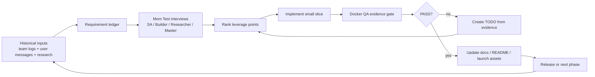
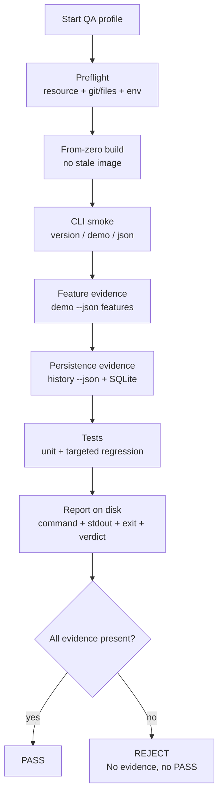
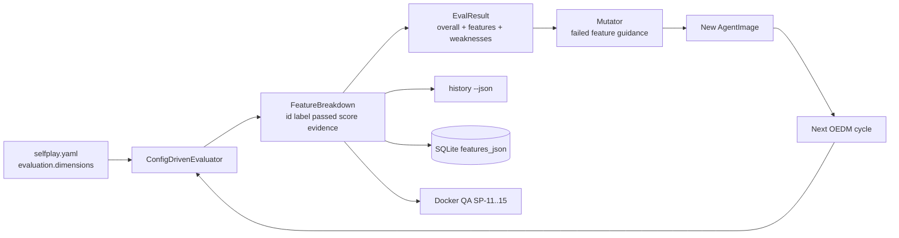
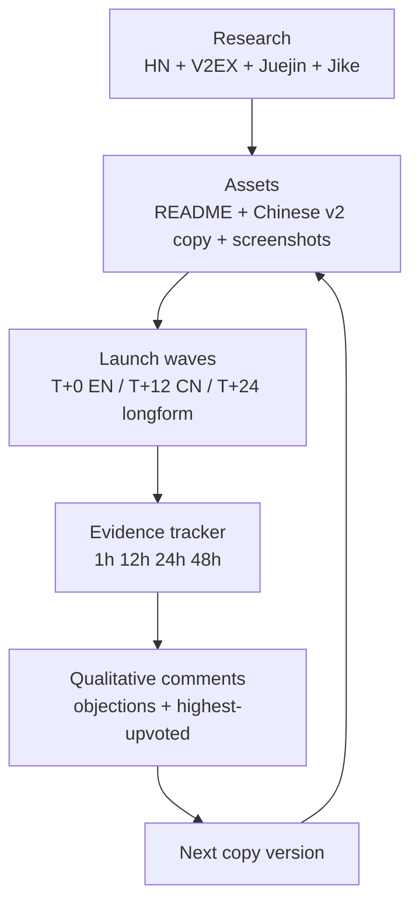

# SelfPlay Mermaid PDCA / Docker QA Mirror

> User directive: use `mermaid-architect` thinking to assist iteration, Docker QA research, and PDCA loops toward a world-class product.
>
> Note: `/Users/swmt/.cc-switch/skills/mermaid-architect/SKILL.md` was not available in this runtime, so this file is a fallback Mermaid architecture mirror.

## 1. Product PDCA Loop

## 2. Docker QA Evidence Gate

## 3. Evaluator Evolution Architecture

## 4. Launch PDCA Mirror

## Operating rule

Every major claim must point to one of: Docker command output, JSON output, SQLite/history evidence, source code line, or launch evidence tracker row. If it cannot be traced, it is a hypothesis, not a PASS.
