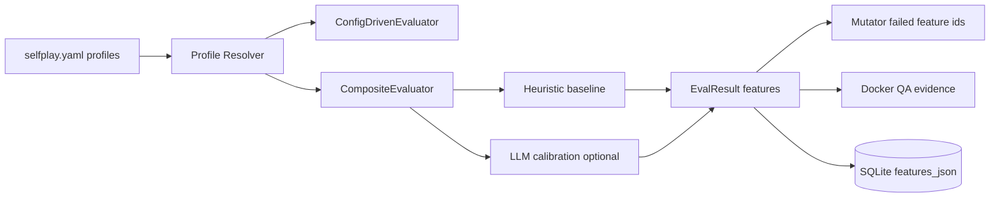
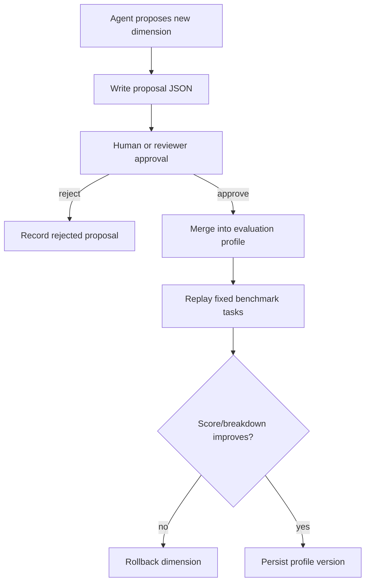

# Phase 2.3 Docker QA Plan — Profiles, Calibration, Self-Evolving Dimensions

Status: draft QA gate. Purpose: define evidence before Phase 2.3 implementation is called PASS.

## Scope

Phase 2.3 adds three risks beyond Phase 2.2:

1. Multiple evaluation profiles can change scoring behavior.
2. Claude/LLM calibration can fail, drift, or leak secrets.
3. Agent-proposed dimensions can mutate the evaluator itself, so approval and replay evidence are mandatory.

## Architecture mirror



## Self-evolving dimension approval loop



## Capability matrix

| ID | Capability | Evidence | Pass gate |
|---|---|---|---|
| SP-16 | Profile loading | `demo --json --config profile.yaml` | selected profile id visible in JSON |
| SP-17 | Runtime-specific profile fallback | mock/claude/codex configs | missing profile falls back with warning, not crash |
| SP-18 | LLM calibration graceful fallback | no SDK/no token run | no secret printed; heuristic result preserved |
| SP-19 | External anchor evidence | unit test/linter/runtime signal | EvalResult records anchor source and confidence |
| SP-20 | Agent-proposed dimension approval | approve/reject fixture | rejected proposal not applied; approved proposal replayed |
| SP-21 | Profile versioning | history/profile JSON | evaluation record links profile id/version |
| SP-22 | Regression parity | default profile replay | Phase 2.2 default score/features remain stable |

## Minimum commands

```bash
# default parity
selfplay --runtime mock demo --cycles 1 --json "qa parity"

# custom profile
selfplay --config fixtures/profile-custom.yaml --runtime mock demo --cycles 1 --json "qa custom"

# missing optional LLM calibration must not fail
SELFPLAY_ENABLE_LLM_CALIBRATION=1 selfplay --runtime mock demo --cycles 1 --json "qa fallback"

# history must show profile metadata once implemented
selfplay history --json
```

## Evidence rule

No Phase 2.3 capability may be marked PASS unless the report records: command, stdout excerpt, exit code, profile id/version, features count, and fallback/approval verdict where applicable.
