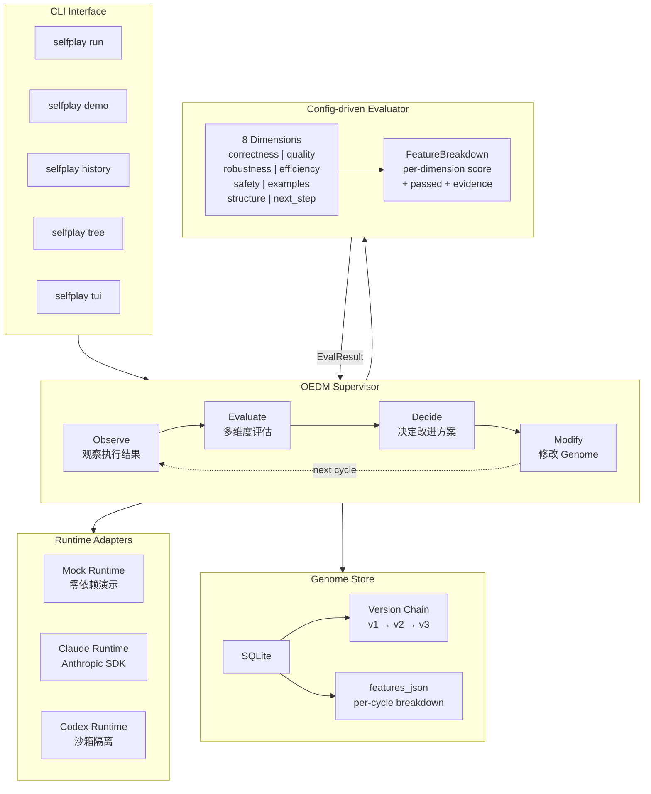
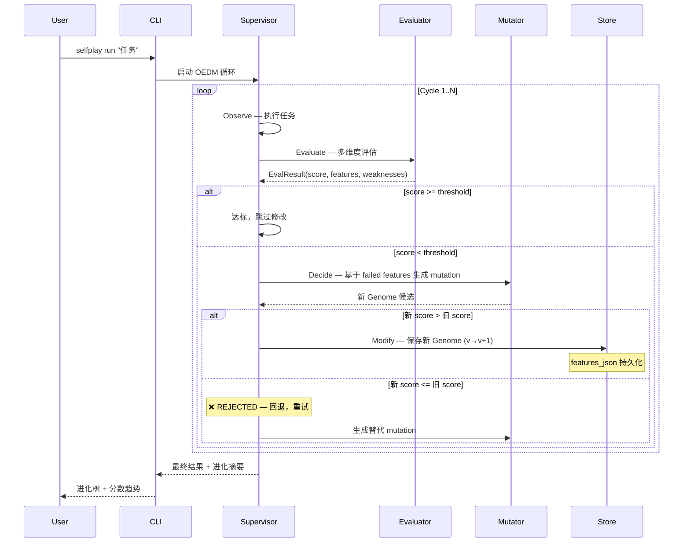
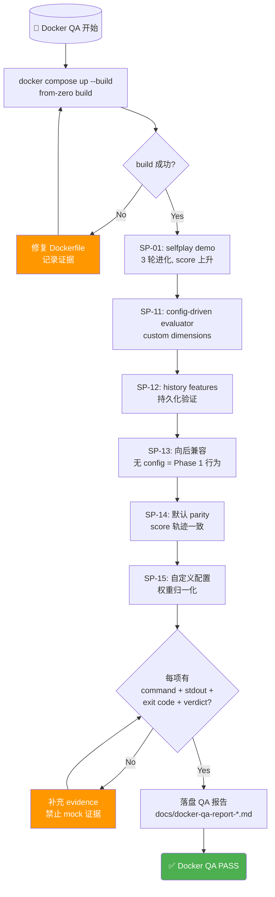
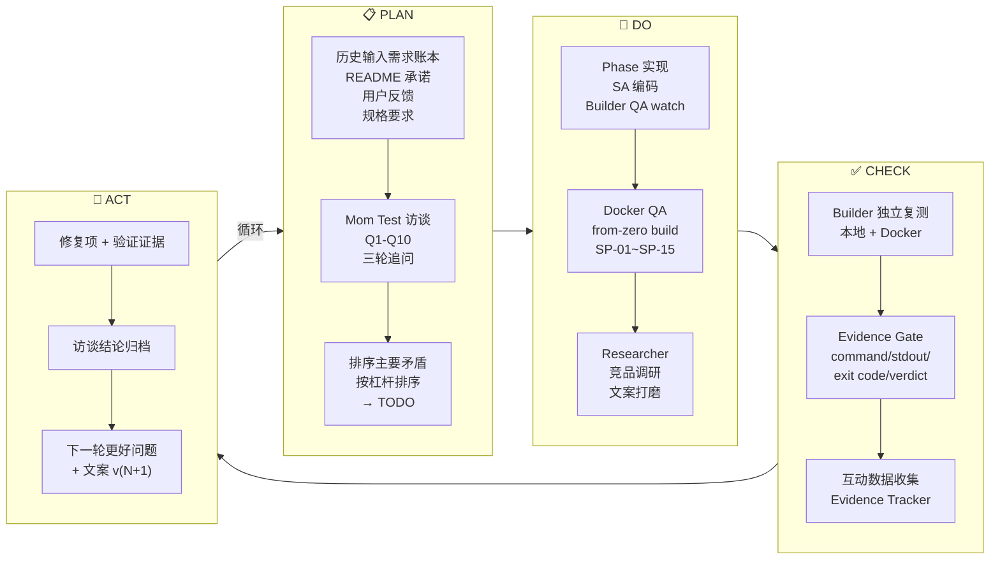
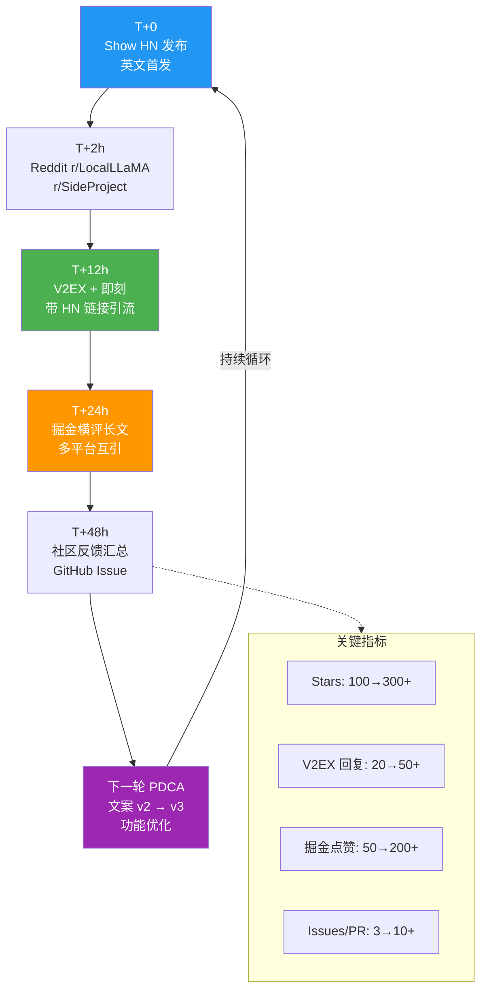
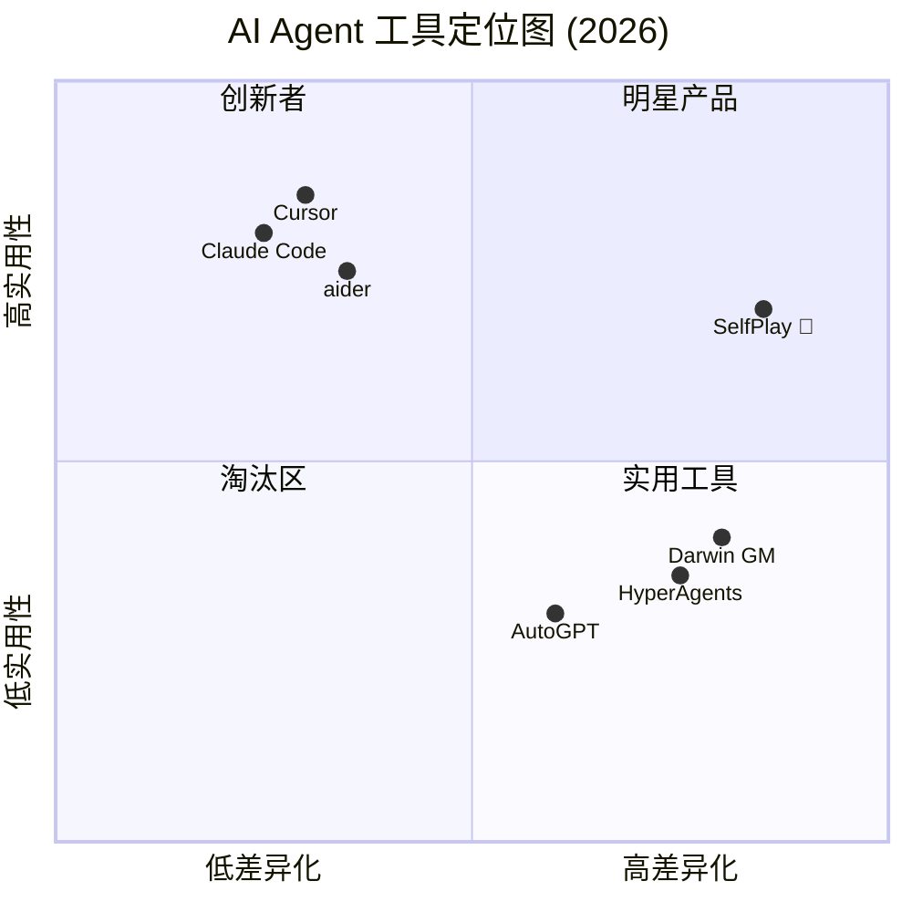

# SelfPlay 架构与迭代 Mermaid 图集

> **目标**：为 PDCA 迭代提供可视化架构参考，辅助团队对齐 + Docker QA + 产品迭代
> **日期**：2026-05-11
> **作者**：Researcher
> **用途**：README 配图 / 团队对齐 / PDCA 看板

---

## 1. SelfPlay 系统架构

---

## 2. OEDM 闭环流程

---

## 3. Docker QA SOP 流程

---

## 4. 发布 PDCA 迭代循环

---

## 5. 发布后 48h 增长飞轮

---

## 6. SelfPlay 竞品定位图

---

## 使用指南

| 图 | 用途 | 放置位置 |
|---|------|---------|
| §1 系统架构 | README 架构节、开发者文档 | README.md 架构节 |
| §2 OEDM 流程序列图 | 技术博客、开发者理解原理 | blog/技术博客 |
| §3 Docker QA 流程 | Docker QA SOP 文档 | docs/docker-qa-sop.md |
| §4 PDCA 迭代循环 | 团队对齐、复盘模板 | docs/pdca-template.md |
| §5 增长飞轮 | 发布策略文档 | research/ 发布策略 |
| §6 竞品定位图 | 投资人/社区展示 | README 或 landing page |

---

*图集完成。可直接嵌入 GitHub README（mermaid 原生支持）。*
