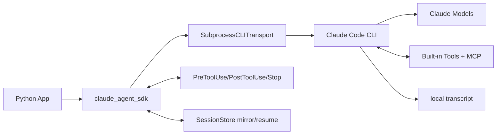
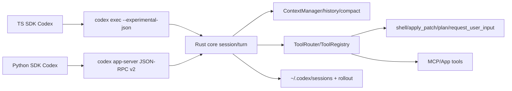

# Claude Agent SDK / Codex Agent SDK 内部机制调研 v0.1

日期：2026-05-09；执行者：Scout。资料口径：公开文档 + 本地浅克隆源码快照。源码快照：`anthropics/claude-agent-sdk-python@5005816`、`openai/codex@ebe75bb`、`openai/openai-agents-python@43e051e`；本机 `codex-cli 0.128.0`，npm `@openai/codex` 查询到 latest 为 `0.130.0`。

## 1. 分层结论

**一句话：** Claude Agent SDK 更像“把 Claude Code CLI 封装成可嵌入 agent loop 的 SDK”，Codex SDK 更像“把 Codex 本地编码 agent/线程运行时封装成 TS/Python 控制面”，二者都不是纯模型 SDK，而是 CLI/运行时 + JSON 事件协议 + 工具调度层。

**三句话：** Claude 的关键抽象是 `query()` 与 `ClaudeSDKClient`，通过子进程 Claude Code CLI 的 stream-json 协议驱动会话，并用 MCP、hooks、permission callback、session_store、AgentDefinition 扩展。Codex 的关键抽象是 `Codex -> Thread -> Turn`：TS SDK 直接 spawn `codex exec --experimental-json`，Python SDK 连接 `codex app-server` JSON-RPC v2；Rust core 负责 turn loop、ContextManager、ToolRouter、sandbox/approval、compact 与 multi-agent。对 GRB/自指最小闭环，建议把“状态镜像/评分/压缩/下一轮策略”放在外层监督器，把 Claude/Codex SDK 当成可替换执行器，统一成 `Thread/Turn/Event/Tool/Memory` 五元接口。

## 2. 架构图描述

### Claude Agent SDK


核心文件：`src/claude_agent_sdk/query.py`、`client.py`、`types.py`、`_internal/query.py`、`_internal/transport/subprocess_cli.py`。

### Codex SDK / CLI runtime


核心文件：`sdk/typescript/src/{codex.ts,thread.ts,exec.ts}`、`sdk/python/src/codex_app_server/{api.py,client.py}`、`codex-rs/core/src/session/{turn.rs,mod.rs}`、`codex-rs/core/src/context_manager/*`、`codex-rs/core/src/tools/*`。

## 3. Claude Agent SDK 机制

| 维度 | 结论 |
|---|---|
| 生命周期 | `query()` 适合一次性/单向流；`ClaudeSDKClient` 适合可交互长会话。`connect()` 启动 CLI 子进程、发送 initialize 控制请求、随后 `query()` 写入 user message，`receive_messages()` 读取 system/assistant/result/tool 等消息。 |
| 上下文 | 上下文主要由 Claude Code CLI 管理；SDK 可设置 `cwd`、`system_prompt`、`setting_sources`、`skills`、`agents`、`session_id`、`resume`、`continue_conversation`。`get_context_usage()` 可返回 categories、totalTokens、memoryFiles、mcpTools、agents 等。 |
| 工具调用 | 默认可用 Claude Code 工具；`tools` 控制基础可见工具，`allowed_tools` 是自动许可，`disallowed_tools` 移除工具。外部/内嵌 MCP 用 `mcp_servers`；Python 函数可用 `@tool` + `create_sdk_mcp_server()` 变成 in-process MCP。 |
| 权限/钩子 | `permission_mode` 支持 default/acceptEdits/plan/bypassPermissions/dontAsk/auto；`can_use_tool` 处理 ask 级工具请求；`hooks` 可在 PreToolUse/PostToolUse/Stop 等阶段注入确定性控制。 |
| 子 agent | `AgentDefinition` 定义 description、prompt、tools、model、skills、mcpServers、maxTurns、permissionMode 等；Claude 通过 Agent 工具调用这些子 agent。 |
| 持久化 | 本地 transcript + `session_store` mirror；支持 list/get/fork/tag/delete/import session 与 subagent 列表。 |

最小可运行片段：
```python
import anyio
from claude_agent_sdk import query, ClaudeAgentOptions, AssistantMessage, TextBlock

async def main():
    opts = ClaudeAgentOptions(
        cwd='.', tools=['Read', 'Grep'], max_turns=1,
        system_prompt='你是只读代码审计 agent。'
    )
    async for msg in query(prompt='总结当前项目结构', options=opts):
        if isinstance(msg, AssistantMessage):
            for b in msg.content:
                if isinstance(b, TextBlock): print(b.text)

anyio.run(main)
```

自定义工具片段：
```python
from claude_agent_sdk import tool, create_sdk_mcp_server, ClaudeAgentOptions, ClaudeSDKClient

@tool('score_state', 'Score loop state', {'state': str})
async def score_state(args):
    return {'content': [{'type': 'text', 'text': 'score=0.82'}]}

server = create_sdk_mcp_server('self-ref-tools', tools=[score_state])
opts = ClaudeAgentOptions(mcp_servers={'selfref': server}, allowed_tools=['mcp__selfref__score_state'])
```

## 4. Codex SDK / Codex Agent 机制

| 维度 | TS SDK | Python SDK | Rust core |
|---|---|---|---|
| 生命周期 | `new Codex().startThread().run()`；每个 run spawn `codex exec --experimental-json`，stdout JSONL 产生 `thread.started`、`item.completed`、`turn.completed` 等事件。 | `Codex()` 启动 `codex app-server --listen stdio://` 并 initialize；`thread_start/resume/fork`，`thread.run()` 或 `turn().stream()/steer()/interrupt()`。 | `Session` 同时最多一个 active task/turn，可 interrupt/steer/compact/review；`run_turn()` 循环采样、执行工具、必要时 follow-up 或 auto-compact。 |
| 上下文 | thread id 持久化在 `~/.codex/sessions`，SDK 可 resume。 | app-server v2 thread API 支持 read/list/archive/compact/fork。 | `ContextManager` 保存 `ResponseItem` 历史、token usage、reference context；每 turn 记录环境/权限/模型/协作模式 diff，超过阈值 pre/mid-turn compact。 |
| 工具调用 | TS SDK 本身不暴露 Python 函数式 tool 注册，主要通过 Codex CLI 内建工具/MCP/config。 | Python SDK 走 app-server 协议，支持 approval handler、turn stream、steer/interrupt；工具由服务端 core 暴露。 | `ToolRouter` + `ToolRegistry` 构造模型可见 specs，处理 function/custom/local shell/MCP/tool_search；`ToolCallRuntime` 串并行调度，Pre/Post hooks、sandbox、approval、goal accounting。 |
| 子 agent | 公开 TS SDK未直接给 spawn_agent API，但底层 CLI/core 有 multi-agent 工具。 | app-server thread/fork/turn 可作为外部多 agent 编排基础。 | 源码含 `agent/*`、`tools/handlers/multi_agents*`、`InterAgentCommunication`、mailbox/registry/status，multi-agent v2 为运行时能力。 |
| 限制 | 每次 `run` 通过 CLI 子进程，控制面较轻；适合嵌入工作流，不适合深度自定义内部工具循环。 | 实验性；绑定 app-server v2，版本与 Codex runtime 强耦合。 | 能力强但非稳定应用 SDK；很多能力由 feature flag/config 驱动。 |

TS 最小片段：
```ts
import { Codex } from '@openai/codex-sdk';
const codex = new Codex({ config: { show_raw_agent_reasoning: false } });
const thread = codex.startThread({ workingDirectory: process.cwd(), skipGitRepoCheck: true });
const turn = await thread.run('诊断测试失败并提出修复');
console.log(turn.finalResponse, turn.usage);
```

Python 最小片段：
```python
from codex_app_server import Codex
with Codex() as codex:
    thread = codex.thread_start(model='gpt-5.4', cwd='.')
    result = thread.run('用一句话说明当前仓库风险')
    print(result.final_response)
```

## 5. Claude vs Codex 对比

| 设计点 | Claude Agent SDK | Codex SDK / CLI |
|---|---|---|
| 抽象中心 | Query/Client + Claude Code CLI | Thread/Turn + Codex CLI/app-server |
| 运行方式 | SDK 启动 Claude Code CLI，stream-json + 控制协议 | TS: spawn `codex exec`；Python: stdio JSON-RPC app-server；Rust core 承载主循环 |
| 上下文可见性 | `get_context_usage()` 已显式暴露 token/category/memory/mcp/agents | ContextManager 内部更丰富；SDK侧主要通过 thread read/usage/compact 间接控制 |
| 工具扩展 | in-process MCP、外部 MCP、hooks、permission callback 清晰 | 主要依赖 Codex config/MCP/内建工具；底层有 dynamic tools，但公开 SDK自定义工具注册较弱 |
| 子 agent | `AgentDefinition` 是公开 SDK 参数 | core 有 multi-agent/subagent，但公开 TS/Python SDK 更偏 thread/fork/turn 控制 |
| 自指闭环适配 | 易于把评分/反思工具做成 MCP + hooks | 易于把完整编码执行器嵌入本地 daemon/TUI；需要外层统一事件与记忆 |

## 6. 对 GRB / 自指最小闭环的建议

最小闭环定义为：`Goal -> Run -> Observe -> Score -> Reflect -> Mutate Policy/Memory -> Next Run`。不要把闭环绑死在某个 SDK 内部；应建一个 SDK-neutral supervisor：

1. **统一事件模型**：`ThreadStarted / TurnStarted / ToolStarted / ToolEnded / Message / Usage / Diff / TurnCompleted / Error`。
2. **统一状态镜像**：每轮保存 prompt、tool trace、diff、token、评分、失败原因、下一轮策略。
3. **统一工具网关**：Claude 走 MCP/hook/can_use_tool；Codex 走 MCP/config/app-server approval/外层 wrapper。
4. **统一 compact 策略**：把“压缩摘要”当成可审计对象，不直接覆盖历史；保留 compact 前后指纹。
5. **统一 agent docker**：`AgentImage = prompt + tools + permissions + memory + eval + runtime adapter`；Claude/Codex 是两个 runtime adapter。

## 7. 主要资料源

- Anthropic Claude Agent SDK docs: https://platform.claude.com/docs/en/agent-sdk/overview
- Claude Agent SDK agent loop / sessions / custom tools: https://platform.claude.com/docs/en/agent-sdk/agent-loop , https://code.claude.com/docs/en/agent-sdk/sessions , https://code.claude.com/docs/en/agent-sdk/custom-tools
- Anthropic Python SDK source: https://github.com/anthropics/claude-agent-sdk-python
- OpenAI Codex docs: https://developers.openai.com/codex
- OpenAI Codex source and SDKs: https://github.com/openai/codex
- OpenAI Agents SDK source（相邻参考，不等同 Codex SDK）: https://github.com/openai/openai-agents-python
